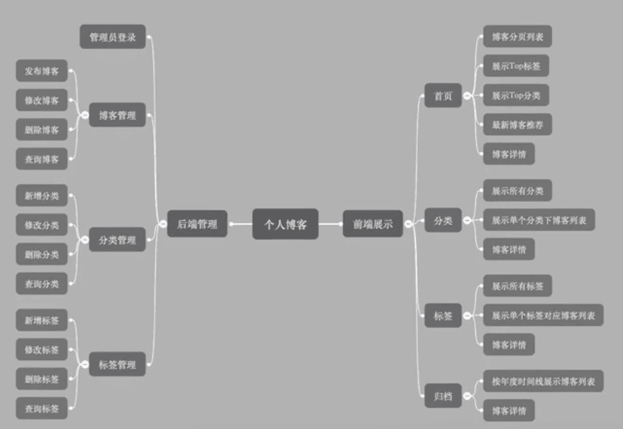
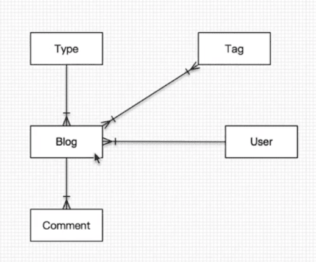
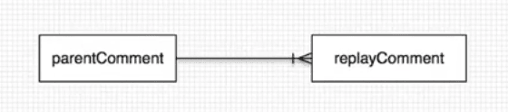
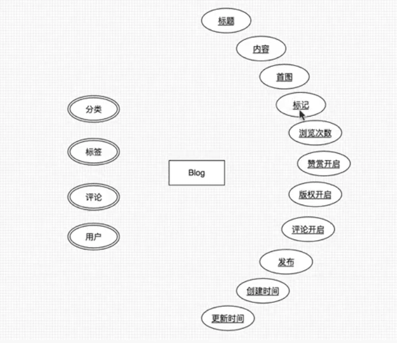
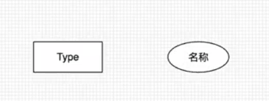
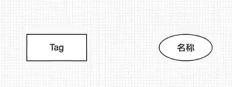
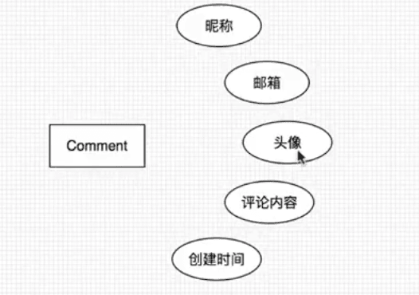
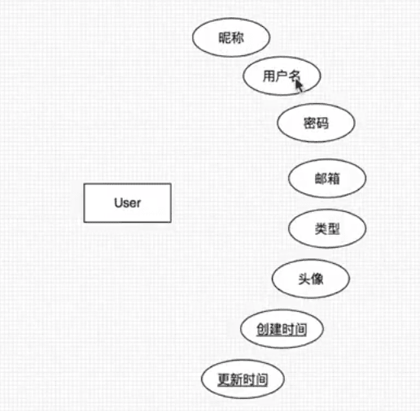
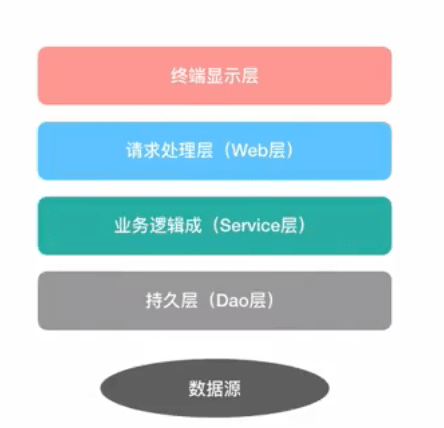

https://www.bilibili.com/video/BV1nE411r7TF

2017-10的视频

## 介绍

博客功能



技术组合

后端：springboot + JPA + thymeleaf

数据库：MySQL

前端UI：[Semantic UI](https://semantic-ui.com/)

工具与环境

IDEA、Maven3、JDK8、Axure RP 8

```
andyron
111111
```


## 1 需求与功能

### 1.1 用户故事

 用户故事模板：

作为一个（某个**角色**）使用者，我可以做（某个**功能**）事情，如此可以有（某个**商业价值**）的好处。

举例：

- 作为一个招聘网站**注册用户**，我想**查看最近3天发布的招聘信息**，以便于**了解最新的招聘信息**。


个人博客系统的用户故事：

角色：普通访客，管理员（我）


- 访客，可以分页查看所有的博客
- 访客，可以快速查看博客数最多的6个分类
- 访客，可以查看所有的分类
- 访客，可以查看某个分类下的博客列表
- 访客，可以快速查看标记博客最多的10个标签
- 访客，可以查看所有的标签
- 访客，可以查看某个标签下的博客列表
- 访客，可以根据年度时间线查看博客列表
- 访客，可以快速查看最新的推荐博客
- 访客，可以用关键字全局搜索博客
- 访客，可以查看单个博客内容
- 访客，可以对博客内容进行评论
- 访客，可以赞赏博客内容
- 访客，可以微信扫码阅读博客内容
- 访客，可以在首页扫描公众号二维码关注我
- 我，可以用户名和密码登录后台管理
- 我，可以管理博客
  - 我，可以发布新博客
  - 我，可以对博客进行分类
  - 我，可以对博客打标签
  - 我，可以修改博客
  - 我，可以删除博客
  - 我，可以根据标题，分类，标签查询博客

- 我，可以管理博客分类
  - 我，可以新增一个分类
  - 我，可以修改一个分类
  - 我，可以删除一个分类
  - 我，可以根据分类名称查询分类
- 我，可以管理标签
  - 我，可以新增一个标签工
  - 我，可以修改一个标签
  - 我，可以删除一个标签
  - 我，可以根据名称查询标签

### 1.2 功能规划


## 2 页面设计与开发

### 2.1 设计


### 2.2 页面开发

移动端预览设置：

```html
	<meta name="viewport" content="width=device-width, initial-scale=1.0">

```

`stackable` 用户手机页面自适应


https://www.toptal.com/designers/subtlepatterns/


### 2.3 插件集成

[编辑器Markdown](https://pandao.github.io/editor.md/)

内容排版[typo.css](https://github.com/sofish/typo.css)

动画[animate.css]()

代码高亮[prism](https://prismjs.com/)

滚动侦测[waypoints](http://imakewebthings.com/waypoints/)

平滑滚动[jquery.scrollTo](https://github.com/flesler/jquery.scrollTo)

目录生成[Tocbot](http://tscanlin.github.io/tocbot/)

二堆码生成[qrcode.js](http://davidshimjs.github.io/qrcodejs/)


Animate.css使用有问题


## 3 框架搭建

### 3.1 构建与配置

视频 2017-10 springboot 1.5.7  

> P20 
>
> Jpa 要改成MyBatis
>
> 22min 日志

#### 1、 引入SpringBoot依赖


#### 2、**application.yml**配置

- 数据库配置
- 日志配置

附加日志配置 **logback-spring.xml** 🔖P20 20min 


### 3.2 异常处理

#### 1定义错误页面

404

500

error

#### 2 错误拦截


### 3.3 日志处理

#### 1、记录日志内容

- 请求url
- 访问者ip
- 调用方法classMethod
- 参数args
- 返回内容


### 3.4 页面处理

1、静态页面导入项目

2、thymeleaf布局

Fragment布局

3、错误页面美化


## 4、设计与规范

### 4.1 实体设计

#### 实体类：

- 博客Blog
- 博客分类Type
- 博客标签Tag
- 博客评论Comment
- 用户User

#### 实体关系



评论类自关联关系：



Blog类：




Type类：




Tag类：




Comment类：



User类：




### 4.2 应用分层




### 4.3 命名约定

Service/DAO层命名约定：

- 获取单个对象的方法用get做前缀。
- 获取多个对象的方法用list做前缀。
- 获取统计值的方法用count做前缀。
- 插入的方法用save(推荐)或insert做前缀。
- 删除的方法用remove(推荐)或delete做前缀，
- 修改的方法用update做前缀。


> hibernate_sequence


## 5、后台管理

### 5.1 登录

1. 构建登录页面和后台管理首页
2. UserService和UserRepository
3. LoginController
4. MD5加密
5. 登录拦截器


### 5.2 分类管理

1. 分类管理页面
2. 分类列表分页


```json
{
  "content": [
    {}
  ],
  "last": false,
  "totalPages": 9,
  "totalElements": 123,
  
  
}
```


3. 分类新增、修改、删除


```
th:unless 和th:if相反
```


### 5.3 标签管理

 

```
@GeneratedValue(strategy = GenerationType.IDENTITY)

IDENTITY    //采用数据库ID自增长的方式来自增主键字段，Oracle 不支持这种方式； 
AUTO        //JPA自动选择合适的策略，是默认选项； 
SEQUENCE    //通过序列产生主键，通过@SequenceGenerator 注解指定序列名，MySql不支持这种方式 
TABLE       //通过表产生主键，框架借由表模拟序列产生主键，使用该策略可以使应用更易于数据库移植。
```

> 🔖@GeneratedValue无法实现自增，`new Type()`得到的id都是0？？


### 5.4 博客管理

1、博客分页查询

2、博客新增

3、博客修改

4、博客删除

继承`JpaSpecificationExecutor<Blog> `接口，用户复杂查询


动态的局部刷新 


🔖P32 35min处的调式方式值得 学习


> P34 22min 卡住的原因，不能添加 id不能自动递增，可能原因：外键、mysql默认参数、@GeneratedValue 。。。


> admin需要优化的地方： p36
>
> - 博客文章新增和修改页面，标签自己添加功能
> - 标签页面的样式和分页
> - 博客新增描述字段


### 全局搜索

## 6、前端展示


### 6.1 前端博客展示


1. 博客列表

2. top分类

3. top标签

4. 最新博客推荐

5. 博客详情

Markdown转换为HTML

commonmark-java

https://github.com/commonmark/commonmark-java

```xml
<dependency>
    <groupId>org.commonmark</groupId>
    <artifactId>commonmark</artifactId>
    <version>0.18.0</version>
</dependency>

```

博客详情评论功能

- 评论信息提交与回复功能
- 评论信息列表展示功能
- 管理员回复评论功能

评论是自关联的


```mysql
set foreign_key_checks = 0;
alter table `t_comment` modify column `id` bigint not null  auto_increment first ;  
set foreign_key_checks = 1;
-- 先接触外键的限制，然后再修改为自动增长
-- 字段属性first表示作为第一列
```

```mysql
 CREATE TABLE `t_comment` (
  `id` bigint(20) NOT NULL AUTO_INCREMENT,
  `avatar` varchar(255) DEFAULT NULL,
  `content` varchar(255) DEFAULT NULL,
  `create_time` datetime(6) DEFAULT NULL,
  `email` varchar(255) DEFAULT NULL,
  `nickname` varchar(255) DEFAULT NULL,
  `blog_id` bigint(20) DEFAULT NULL,
  `parent_comment_id` bigint(20) DEFAULT NULL,
  PRIMARY KEY (`id`),
  KEY `FKke3uogd04j4jx316m1p51e05u` (`blog_id`),
  KEY `FK4jj284r3pb7japogvo6h72q95` (`parent_comment_id`),
  CONSTRAINT `FK4jj284r3pb7japogvo6h72q95` FOREIGN KEY (`parent_comment_id`) REFERENCES `t_comment` (`id`),
  CONSTRAINT `FKke3uogd04j4jx316m1p51e05u` FOREIGN KEY (`blog_id`) REFERENCES `t_blog` (`id`)
) ENGINE=InnoDB AUTO_INCREMENT=2 DEFAULT CHARSET=utf8mb4 COLLATE=utf8mb4_0900_ai_ci 

CREATE TABLE `t_blog` (
  `id` bigint(20) NOT NULL,
  `title` varchar(255) DEFAULT NULL,
  `appreciation` bit(1) NOT NULL,
  `commentabled` bit(1) NOT NULL,
  `create_time` datetime(6) DEFAULT NULL,
  `first_picture` varchar(255) DEFAULT NULL,
  `flag` varchar(255) DEFAULT NULL,
  `published` bit(1) NOT NULL,
  `recommend` bit(1) NOT NULL,
  `share_statement` bit(1) NOT NULL,
  `description` longtext,
  `content` longtext,
  `update_time` datetime(6) DEFAULT NULL,
  `views` int(11) DEFAULT NULL,
  `type_id` bigint(20) DEFAULT NULL,
  `user_id` bigint(20) DEFAULT NULL,
  PRIMARY KEY (`id`),
  KEY `FK292449gwg5yf7ocdlmswv9w4j` (`type_id`),
  KEY `FK8ky5rrsxh01nkhctmo7d48p82` (`user_id`),
  CONSTRAINT `FK292449gwg5yf7ocdlmswv9w4j` FOREIGN KEY (`type_id`) REFERENCES `t_type` (`id`),
  CONSTRAINT `FK8ky5rrsxh01nkhctmo7d48p82` FOREIGN KEY (`user_id`) REFERENCES `t_user` (`id`)
) ENGINE=InnoDB DEFAULT CHARSET=utf8mb4 COLLATE=utf8mb4_0900_ai_ci
```

保存时报错，外键影响，导致不能添加数据

```bash
2021-11-03 16:37:38.160  INFO 6293 --- [nio-8080-exec-4] com.andyron.arblog.aspect.LogAspect      : Request : {url='http://localhost:8080/comments', ip='0:0:0:0:0:0:0:1', classMethod='com.andyron.arblog.web.CommentController.post', args=[Comment{id=null, nickname='小戎', email='rongming.2008@163.com', content='评论测试', avatar='null', createTime=null}]}
Hibernate: insert into t_comment (avatar, blog_id, content, create_time, email, nickname, parent_comment_id) values (?, ?, ?, ?, ?, ?, ?)
2021-11-03 16:37:38.186  WARN 6293 --- [nio-8080-exec-4] o.h.engine.jdbc.spi.SqlExceptionHelper   : SQL Error: 1452, SQLState: 23000
2021-11-03 16:37:38.187 ERROR 6293 --- [nio-8080-exec-4] o.h.engine.jdbc.spi.SqlExceptionHelper   : Cannot add or update a child row: a foreign key constraint fails (`arblog`.`t_comment`, CONSTRAINT `FK4jj284r3pb7japogvo6h72q95` FOREIGN KEY (`parent_comment_id`) REFERENCES `t_comment` (`id`))
2021-11-03 16:37:38.256 ERROR 6293 --- [nio-8080-exec-4] c.a.a.h.ControllerExceptionHandler       : Request URL : http://localhost:8080/comments, Exception : could not execute statement; SQL [n/a]; constraint [null]; nested exception is org.hibernate.exception.ConstraintViolationException: could not execute statement
2021-11-03 16:37:38.257  WARN 6293 --- [nio-8080-exec-4] .m.m.a.ExceptionHandlerExceptionResolver : Resolved [org.springframework.dao.DataIntegrityViolationException: could not execute statement; SQL [n/a]; constraint [null]; nested exception is org.hibernate.exception
```


P40

p43


博客按分类展示


博客按标签按展示


博客归纳


关于我展示及功能完善


PqueryP


### 6.2 分类页


### 6.3 标签页


### 6.4 归档页


### 6.5 关于我

